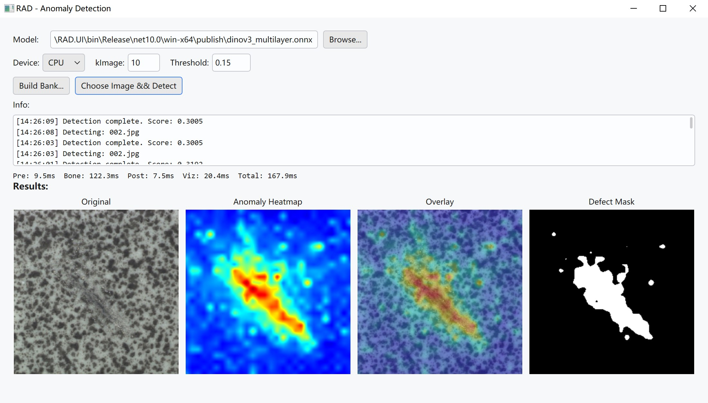

# RAD C# — Cross-Platform Anomaly Detection

[中文](README.zh-CN.md)

Desktop application for visual anomaly detection using DINOv3 features. Based on the [RAD](https://github.com/longkukuhi/RAD) method — a training-free approach that builds a memory bank from normal samples and detects anomalies via patch-level KNN retrieval.



## Features

- **No training required** — only a few normal images to build the memory bank
- **Cross-platform** — Windows / Linux / macOS via MewUI + .NET NativeAOT
- **GPU acceleration** — DirectML support on Windows with CPU fallback
- **Single-file publish** — NativeAOT compiles to a standalone executable

## How It Works

1. **Load Model** — Select the DINOv3 ONNX model
2. **Build Bank** — Point to a folder of normal images to extract features
3. **Detect** — Select an image to compute anomaly heatmap, overlay, and binary mask

## Quick Start

### Requirements
- [.NET 10 SDK](https://dotnet.microsoft.com/download/dotnet/10.0)

### Build & Run
```bash
dotnet run --project src/RAD.UI/RAD.UI.csproj
```

### Publish (single-file executable)
```bash
dotnet publish src/RAD.UI/RAD.UI.csproj -c Release -r win-x64 --self-contained
# Output: src/RAD.UI/bin/Release/net10.0/win-x64/publish/RAD.UI.exe
```

Replace `win-x64` with `linux-x64` or `osx-arm64` as needed.

## Project Structure

```
RAD-csharp/
├── model/                  # DINOv3 ONNX model
│   └── dinov3_multilayer.onnx
├── sample/                 # Example images
│   ├── OK/                 # Normal samples (for building bank)
│   └── NG/                 # Anomaly samples (for testing)
├── src/
│   ├── RAD.Detector/       # Core inference library
│   │   ├── ONNX Runtime inference
│   │   ├── Memory bank construction & KNN retrieval
│   │   ├── Image preprocessing (ImageSharp)
│   │   └── Visualization (heatmap, overlay, mask)
│   └── RAD.UI/             # Desktop GUI (MewUI)
└── RAD-main/               # Python reference (not in source tree)
```

## Dependencies

| Library | Purpose |
|---------|---------|
| ONNX Runtime (DirectML) | DINOv3 model inference |
| SixLabors.ImageSharp | Image preprocessing & visualization |
| MewUI | Cross-platform desktop GUI |

## Reference

- [RAD Paper Repository](https://github.com/longkukuhi/RAD)

## License

MIT

---

<div align="center">
If this project helps you, please give it a ⭐ Star!
</div>
